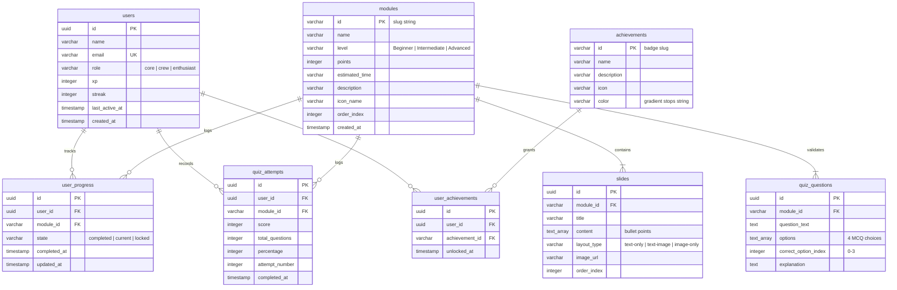
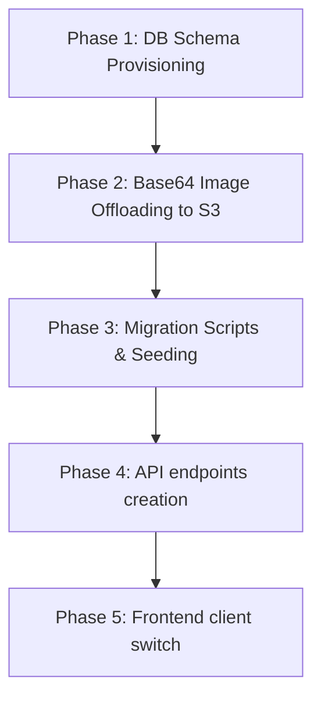

# AWS Roadmap Platform - Database Migration Guide

This document defines the schema architecture, initial seed datasets, and migration roadmap required to transition the **AWS Roadmap Platform** from a client-side mock-persisted state (using Zustand's `localStorage` middleware) to a production-grade relational database backend.

---

## SECTION 1: DATABASE ARCHITECTURE SUMMARY

### Choice of Database: PostgreSQL
PostgreSQL is recommended for the AWS Roadmap backend for the following reasons:
1. **Rich Column Types**: Built-in support for `TEXT[]` arrays (for slide bullets and quiz options) and `JSONB` properties (for audit records).
2. **Relational Constraints**: Enforces absolute integrity across users, modules, slide ordering, and quiz score logs using foreign keys and cascade deletions.
3. **Optimized Indexing**: Provides indexes on student emails, module levels, and progress states to support the gradebook and dashboard telemetry views.

---

## SECTION 2: ENTITY RELATIONSHIP DIAGRAM (ERD)



---

## SECTION 3: SCHEMA DDL (DATA DEFINITION LANGUAGE)

Run the following SQL scripts to provision the database schema:

```sql
-- Enable UUID extension
CREATE EXTENSION IF NOT EXISTS "uuid-ossp";

-- 1. USERS TABLE
CREATE TABLE users (
    id UUID PRIMARY KEY DEFAULT uuid_generate_v4(),
    name VARCHAR(100) NOT NULL,
    email VARCHAR(150) UNIQUE NOT NULL,
    role VARCHAR(20) NOT NULL DEFAULT 'enthusiast' CHECK (role IN ('core', 'crew', 'enthusiast')),
    xp INTEGER NOT NULL DEFAULT 0 CHECK (xp >= 0),
    streak INTEGER NOT NULL DEFAULT 0 CHECK (streak >= 0),
    last_active_at TIMESTAMP WITH TIME ZONE DEFAULT CURRENT_TIMESTAMP,
    created_at TIMESTAMP WITH TIME ZONE DEFAULT CURRENT_TIMESTAMP
);

-- 2. CURRICULUM MODULES TABLE
CREATE TABLE modules (
    id VARCHAR(50) PRIMARY KEY, -- String slug as PK to maintain matching frontend configurations (e.g. 'fundamentals')
    name VARCHAR(100) NOT NULL,
    level VARCHAR(20) NOT NULL CHECK (level IN ('Beginner', 'Intermediate', 'Advanced')),
    points INTEGER NOT NULL CHECK (points > 0),
    estimated_time VARCHAR(30) NOT NULL,
    description TEXT NOT NULL,
    icon_name VARCHAR(50) NOT NULL DEFAULT 'Boxes',
    order_index INTEGER NOT NULL,
    created_at TIMESTAMP WITH TIME ZONE DEFAULT CURRENT_TIMESTAMP
);

-- 3. SLIDES TABLE
CREATE TABLE slides (
    id UUID PRIMARY KEY DEFAULT uuid_generate_v4(),
    module_id VARCHAR(50) NOT NULL REFERENCES modules(id) ON DELETE CASCADE,
    title VARCHAR(150) NOT NULL,
    content TEXT[] NOT NULL, -- Array of bullet statements
    layout_type VARCHAR(20) NOT NULL DEFAULT 'text-only' CHECK (layout_type IN ('text-only', 'text-image', 'image-only')),
    image_url TEXT, -- Storage URL (e.g., S3 endpoint link instead of Base64 strings)
    order_index INTEGER NOT NULL,
    created_at TIMESTAMP WITH TIME ZONE DEFAULT CURRENT_TIMESTAMP
);

-- 4. QUIZ QUESTIONS TABLE
CREATE TABLE quiz_questions (
    id UUID PRIMARY KEY DEFAULT uuid_generate_v4(),
    module_id VARCHAR(50) NOT NULL REFERENCES modules(id) ON DELETE CASCADE,
    question_text TEXT NOT NULL,
    options TEXT[] NOT NULL CHECK (cardinality(options) = 4), -- Forces exactly 4 multiple-choice options
    correct_option_index INTEGER NOT NULL CHECK (correct_option_index BETWEEN 0 AND 3),
    explanation TEXT NOT NULL
);

-- 5. STUDENT PROGRESS OVERVIEW TABLE
CREATE TABLE user_progress (
    id UUID PRIMARY KEY DEFAULT uuid_generate_v4(),
    user_id UUID NOT NULL REFERENCES users(id) ON DELETE CASCADE,
    module_id VARCHAR(50) NOT NULL REFERENCES modules(id) ON DELETE CASCADE,
    state VARCHAR(20) NOT NULL DEFAULT 'locked' CHECK (state IN ('completed', 'current', 'locked')),
    completed_at TIMESTAMP WITH TIME ZONE,
    updated_at TIMESTAMP WITH TIME ZONE DEFAULT CURRENT_TIMESTAMP,
    UNIQUE(user_id, module_id)
);

-- 6. DETAILED QUIZ ATTEMPTS LOGS
CREATE TABLE quiz_attempts (
    id UUID PRIMARY KEY DEFAULT uuid_generate_v4(),
    user_id UUID NOT NULL REFERENCES users(id) ON DELETE CASCADE,
    module_id VARCHAR(50) NOT NULL REFERENCES modules(id) ON DELETE CASCADE,
    score INTEGER NOT NULL CHECK (score >= 0),
    total_questions INTEGER NOT NULL CHECK (total_questions > 0),
    percentage INTEGER NOT NULL CHECK (percentage BETWEEN 0 AND 100),
    attempt_number INTEGER NOT NULL CHECK (attempt_number > 0),
    completed_at TIMESTAMP WITH TIME ZONE DEFAULT CURRENT_TIMESTAMP
);

-- 7. SYSTEM ACHIEVEMENTS DEFINITIONS
CREATE TABLE achievements (
    id VARCHAR(50) PRIMARY KEY,
    name VARCHAR(100) NOT NULL,
    description TEXT NOT NULL,
    icon VARCHAR(50) NOT NULL,
    color VARCHAR(100) NOT NULL
);

-- 8. USER ACHIEVEMENTS TRACKER
CREATE TABLE user_achievements (
    id UUID PRIMARY KEY DEFAULT uuid_generate_v4(),
    user_id UUID NOT NULL REFERENCES users(id) ON DELETE CASCADE,
    achievement_id VARCHAR(50) NOT NULL REFERENCES achievements(id) ON DELETE CASCADE,
    unlocked_at TIMESTAMP WITH TIME ZONE DEFAULT CURRENT_TIMESTAMP,
    UNIQUE(user_id, achievement_id)
);

-- 9. TELEMETRY SYSTEM ALERTS LOG
CREATE TABLE security_alerts (
    id UUID PRIMARY KEY DEFAULT uuid_generate_v4(),
    title VARCHAR(200) NOT NULL,
    description TEXT NOT NULL,
    type VARCHAR(20) NOT NULL DEFAULT 'info' CHECK (type IN ('warning', 'info', 'success')),
    created_at TIMESTAMP WITH TIME ZONE DEFAULT CURRENT_TIMESTAMP
);

-- 10. INDEXES FOR PERFORMANCE OPTIMIZATION
CREATE INDEX idx_user_progress_search ON user_progress(user_id, state);
CREATE INDEX idx_quiz_attempts_lookup ON quiz_attempts(user_id, module_id);
CREATE INDEX idx_modules_level_order ON modules(level, order_index);
CREATE INDEX idx_slides_module_order ON slides(module_id, order_index);
```

---

## SECTION 4: DATA DML (SEED DATA SCRIPTS)

Run these scripts to populate initial configurations, matching current mock data listings:

### 1. Seed System Achievements
```sql
INSERT INTO achievements (id, name, description, icon, color) VALUES
('badge1', 'Early Bird', 'Logged in and started the path early', 'Sparkles', 'from-amber-400 to-orange-500'),
('badge2', 'Week Streak', 'Maintained a 7-day learning streak', 'Flame', 'from-orange-500 to-rose-600'),
('badge3', 'Quiz Master', 'Completed 5 quizzes with zero failures', 'Award', 'from-blue-400 to-indigo-500'),
('badge4', 'Explorer', 'Unlocked all Beginner modules', 'Compass', 'from-emerald-400 to-teal-500');
```

### 2. Seed Mock Student Users
```sql
-- Generating UUIDs for referencing inside progress tables
INSERT INTO users (id, name, email, role, xp, streak) VALUES
('aa11b22c-33dd-44ee-55ff-660000000001', 'Sarah Connor', 's.connor@university.edu', 'enthusiast', 2450, 15),
('aa11b22c-33dd-44ee-55ff-660000000002', 'Marcus Wright', 'm.wright@cloudclub.org', 'enthusiast', 1800, 8),
('aa11b22c-33dd-44ee-55ff-660000000003', 'John Connor', 'j.connor@cyberdyne.io', 'enthusiast', 2900, 22),
('aa11b22c-33dd-44ee-55ff-660000000004', 'Kyle Reese', 'k.reese@resistance.net', 'enthusiast', 950, 4),
('aa11b22c-33dd-44ee-55ff-660000000005', 'Dr. Peter Silberman', 'silberman@hospital.org', 'enthusiast', 450, 0),
('aa11b22c-33dd-44ee-55ff-660000000006', 'Admin Instructor', 'staff@cloudclub.org', 'core', 0, 0);
```

### 3. Seed Modules Curriculum (Sample representation of first Beginner modules)
```sql
INSERT INTO modules (id, name, level, points, estimated_time, description, icon_name, order_index) VALUES
('fundamentals', 'AWS Fundamentals', 'Beginner', 50, '15 Minutes', 'Learn the core global infrastructure, cloud concepts, Regions, Availability Zones, and basic AWS services.', 'Globe', 1),
('ec2', 'Amazon EC2', 'Beginner', 50, '20 Minutes', 'Provision and configure virtual servers (compute instances) in the cloud with custom operating systems.', 'Cpu', 2),
('s3', 'Amazon S3', 'Beginner', 50, '15 Minutes', 'Store objects (files) securely at massive scale with low latency and high availability.', 'Database', 3),
('iam', 'AWS IAM', 'Beginner', 50, '15 Minutes', 'Manage identities, permissions, and roles to secure access to your AWS environment.', 'ShieldAlert', 4),
('vpc', 'Amazon VPC', 'Beginner', 50, '25 Minutes', 'Design and deploy custom isolated virtual networks with subnets, gateways, and routing.', 'Network', 5),
('beanstalk', 'Elastic Beanstalk', 'Beginner', 75, '15 Minutes', 'Deploy and scale web apps and services written in Java, .NET, PHP, Node.js, Python, Ruby, and Docker.', 'Layers', 6);
```

### 4. Seed Content Slides (Sample representation of AWS Fundamentals slides)
```sql
INSERT INTO slides (module_id, title, content, layout_type, order_index) VALUES
('fundamentals', 'AWS Global Infrastructure Overview', ARRAY['AWS cloud infrastructure is built around Regions and Availability Zones.', 'A Region is a physical location in the world where AWS has multiple Availability Zones.', 'Availability Zones consist of one or more discrete data centers, each with redundant power, networking, and connectivity.'], 'text-only', 1),
('fundamentals', 'Availability Zones (AZs) Details', ARRAY['AZs are isolated from each other to prevent disasters from spreading.', 'They are connected through low-latency, high-speed fiber-optic links.', 'Designing systems to run across multiple AZs ensures High Availability (HA) and Fault Tolerance.'], 'text-only', 2),
('fundamentals', 'Edge Locations & CloudFront', ARRAY['Edge Locations are endpoints used by AWS to cache assets globally.', 'They work in tandem with Amazon CloudFront (CDN) to reduce latency for end-users.', 'They are separated from standard AWS Regions to optimize content delivery speed.'], 'text-image', 3),
('fundamentals', 'Shared Responsibility Model', ARRAY['AWS is responsible for "Security of the Cloud" (hardware, hypervisors, physical security).', 'The customer is responsible for "Security in the Cloud" (data encryption, OS configuration, IAM users, firewall settings).', 'Understanding this model is critical for passing AWS Certification exams.'], 'text-only', 4);
```

### 5. Seed Quiz Questions (Sample representation of AWS Fundamentals quiz questions)
```sql
INSERT INTO quiz_questions (module_id, question_text, options, correct_option_index, explanation) VALUES
('fundamentals', 'Which of the following consists of one or more discrete data centers with redundant power, networking, and connectivity in an AWS Region?', ARRAY['Edge Location', 'Availability Zone', 'Direct Connect Endpoint', 'VPC Subnet'], 1, 'An Availability Zone (AZ) is one or more discrete data centers with redundant power, networking, and connectivity in an AWS Region.'),
('ec2', 'Which firewall mechanism is stateful and operates at the Amazon EC2 instance level to control traffic?', ARRAY['Network ACL (NACL)', 'Security Group', 'Route Table', 'Internet Gateway'], 1, 'Security groups are stateful firewalls that control inbound and outbound traffic at the instance level. Network ACLs are stateless and operate at the subnet level.');
```

---

## SECTION 5: STEP-BY-STEP MIGRATION PLAN



### Phase 1: DB Schema Provisioning
1. Spin up a PostgreSQL instance on AWS RDS.
2. Connect using an admin client and execute the DDL queries defined in **Section 3**.
3. Confirm indexing and primary unique constraints are configured correctly.

### Phase 2: Base64 Image Conversion & Offloading to S3
1. Extract current CMS slides containing inline Base64 graphics.
2. Write a Python script to convert Base64 files to binary image format (PNG/JPEG).
3. Upload binary images to an Amazon S3 bucket linked to CloudFront CDN.
4. Replace original Base64 strings with public URLs (e.g. `https://cdn.cloudclub.org/assets/...`) inside the DML seed scripts.

### Phase 3: Seeding Database
1. Execute DML queries defined in **Section 4** to populate modules, slides, and default questions.
2. Verify table relationships and check ordering parameters.

### Phase 4: API Service Layer construction
Create backend endpoints to replace frontend operations:
* **Roadmap Navigation**: `GET /api/modules` -> returns modules list ordered by index.
* **Module Details**: `GET /api/modules/:id` -> returns learningContent slides and quiz questions.
* **Progress Logger**: `POST /api/progress/mark-read` -> inserts/updates `user_progress` rows.
* **Quiz Validator**: `POST /api/progress/submit-quiz` -> records `quiz_attempts`, recalculates streaks/XP, marks `completed`, and unlocks the next module.

### Phase 5: Frontend switch
1. Configure `NEXT_PUBLIC_API_URL` environment variables pointing to backend servers.
2. Update **[apiClient.ts](file:///d:/AWS%20ROADMAP/frontend/src/services/apiClient.ts)** to establish authentication interceptors.
3. Modify **[roadmapStore.ts](file:///d:/AWS%20ROADMAP/frontend/src/store/roadmapStore.ts)** to disable Zustand persistence and fetch data using queries instead of reading localstorage cache.

---

## SECTION 6: DATA INTEGRITY & EDGE CASES

1. **Streak Calculations**:
   - The backend must track and calculate streaks based on the timestamp of the last database query.
   - When a student completes a daily quiz, evaluate:
     - If `last_active_at` is today -> do not modify streak.
     - If `last_active_at` is yesterday -> increment streak.
     - If `last_active_at` is older than 48 hours -> reset streak to 0.
2. **XP and Ranks Boundaries**:
   - Limit student scores and progression on the backend. Every 1000 XP increments the user's level (e.g., Level 1 = 0-999 XP, Level 2 = 1000-1999 XP).
3. **Sequential Path Safeguard**:
   - Block API requests to write progress/scores to locked modules. Verify that all preceding modules are marked `'completed'` in `user_progress` before validating quiz scoring requests.
